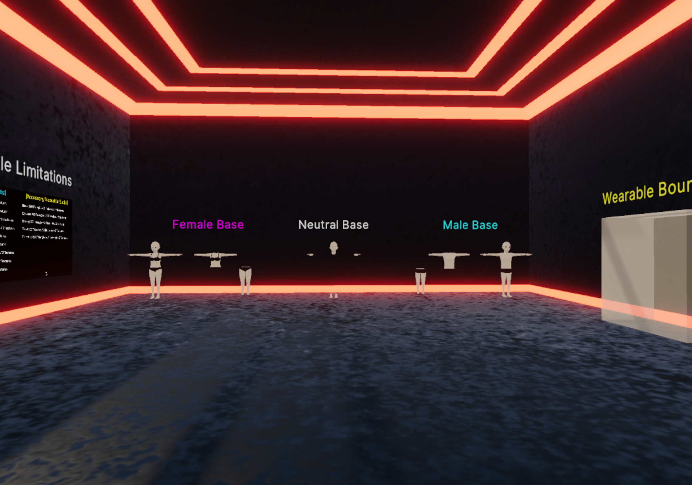

# Wearable Starting File

## Introduction

This Read Me file provides a comprehensive guide for aspiring Decentraland wearable creators, equipping them with the necessary tools and resources to embark on their exciting journey in the metaverse. At the heart of this guide lies a robust Blender file, meticulously crafted to assist newcomers in seamlessly creating their very first wearable items.

## The Fuego Power of the Blender File

Included within this repository is an invaluable Blender file that serves as a central hub for all your wearable creation needs. This carefully constructed file showcases a plethora of GLB examples, featuring avatar bodies and a bounding box. By examining these examples, you can gain a deeper understanding of the size limitations for wearables and ensure your creations adhere to the optimal specifications. Finally, this file is equipped with three Decentraland armatures that are used for rigging/weight painting wearables.

It's worth noting to always keep an original version of this file on hand so if anything happens or certain parts get corrupted for any reason you have a back up.

## Interactive In-Game Visualization

To enhance your learning experience, we have gone the extra mile and provided an immersive in-game visualization. This repo contains a meticulously crafted scene that expertly lays out all the essential elements. You can effortlessly run this scene locally, or better yet, deploy it to one of your worlds within Decentraland. By doing so, you can witness your wearables come to life and get a realistic feel for their appearance within the game environment. You will see images on the walls that give triangle, material, and texture limitation for wearables.

## Get Started on Your Wearable Creation Journey

We understand that embarking on a new creative endeavor can be overwhelming, but fear not! With this comprehensive guide and the powerful Blender file at your disposal, you'll be well-equipped to venture into the exciting realm of Decentraland wearable creation. So, let's dive in, unleash your imagination, and bring your unique wearables to life in the metaverse!

## How to Use this Repository

1. Clone this repository to your local machine.
2. Open the included Blender file, which serves as your ultimate wearable creation guidebook.
3. Explore the GLB examples of avatar bodies and take note of the size limitations for your future wearables.
4. Run the scene locally or deploy it to one of your Decentraland worlds for an immersive in-game experience.
5. Refer to the accompanying documentation for detailed instructions and tips on optimizing your wearable creations.
6. Join the vibrant Decentraland community, where you can share your creations, seek guidance, and inspire others with your unique designs.

## Let the Wearable Creation Magic Begin!

With this guide and the accompanying Blender file, you are poised to unlock your full creative potential in Decentraland. Step into the world of immersive wearables, where your imagination knows no bounds. Start crafting unique, eye-catching items that will dazzle and inspire others. Join us on this exhilarating journey as we shape the future of the metaverse, one wearable at a time.

## Author Conclusion

This scene was brought to you by Nikki Fuego and Doki. If you have any issues with this repository or any questions, please feel free to reach out to us on Twitter or Discord.
